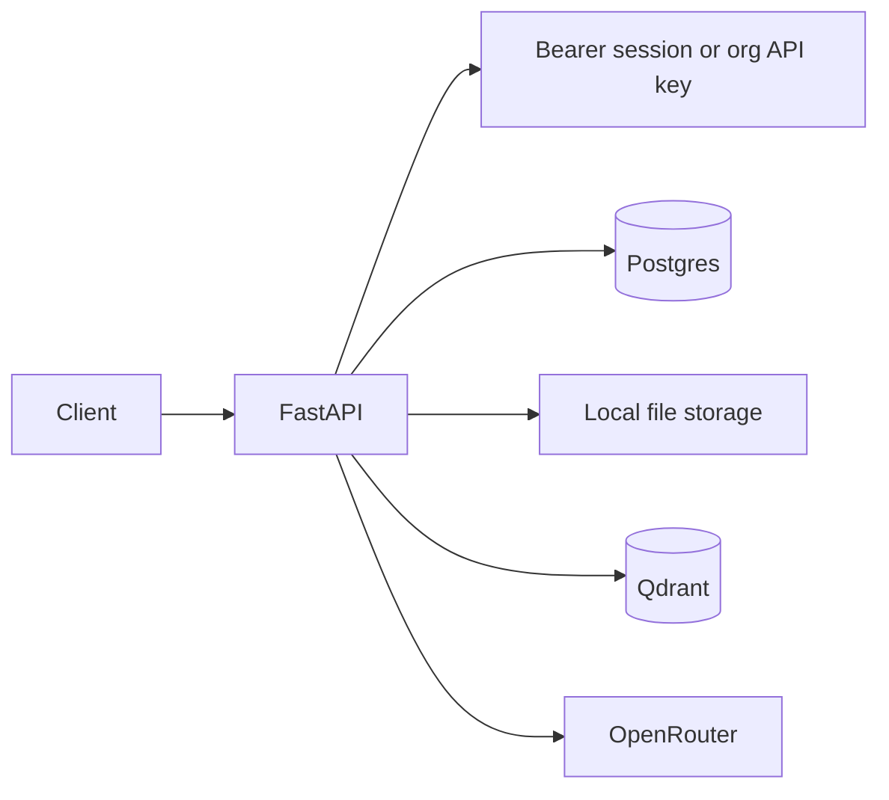
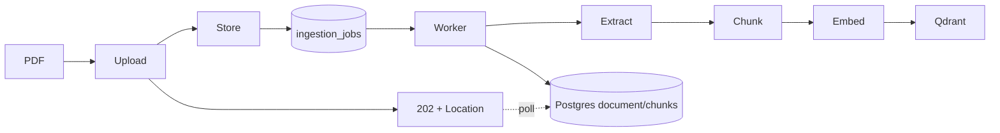
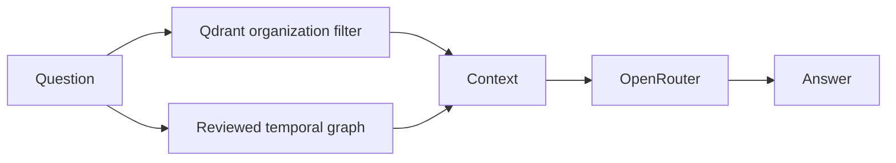
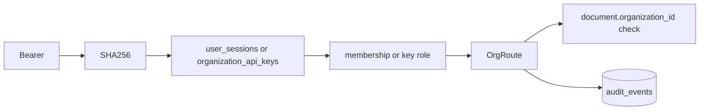

# Sentineth Project Status

## Vision

Sentineth is intended to be a company intelligence platform: it should connect Slack, Teams, GitHub, email, meetings, documents, and internal systems; continuously build organizational memory; become the company-wide source of truth; answer questions with grounded retrieval; and eventually power agent workflows.

## Current State Summary

The repository is complete through Phase 4 of `docs/ROADMAP.md`. Today it
provides a backend-first PDF organizational-intelligence service with
service: organizations, organization-filtered document storage and Qdrant
search, measured retrieval, durable background ingestion behind an async
202 contract, bounded inputs and per-organization quotas, and OpenRouter
answer generation. Requests now carry an actor: user accounts, sessions,
invitations, owner/member/viewer roles on both people and API keys, an
append-only audit trail, health and readiness probes, metrics, a container
image and a rehearsed restore. Stable sources feed a separately queued extraction
pass whose person, project, decision and temporal relationship proposals require
human review. Queries combine vectors with a reviewed two-hop graph and cite the
supporting sources. It has no frontend, connectors or agents.

Architecture: FastAPI + SQLAlchemy/Postgres for state and for the job
queue, separate worker processes for ingestion and knowledge extraction, local filesystem for
source files, Qdrant for vectors, NVIDIA `nemotron-3-embed-1b` for
embeddings (MiniLM remains as the offline provider), and OpenRouter for
the answer model.

## Completed Work

### Multi-Tenant Foundation

`Organization`, `Document`, and Qdrant payloads carry organization identity. Retrieval filters Qdrant by `organization_id`; document deletion/reindex services compare the URL organization with `Document.organization_id`.

### Security Hardening

Commit `d8dec032e40c1b20f704f52fd82642b9aef90d45` — `feat: secure organization document lifecycle` — adds `OrganizationApiKey`, SHA-256 key storage, one-time key creation, rotation, route authorization, document ownership validation, and organization-scoped vector deletion. See `backend/app/security.py`, `backend/app/main.py`, and `backend/app/services/document_service.py`.

### RAG Infrastructure

PDF upload extracts text with pypdf, chunks it, embeds chunks, stores vectors in Qdrant, retrieves tenant-filtered chunks, and sends grounded context to OpenRouter. Sources return document/chunk metadata. Core paths are `backend/app/services/ingestion_service.py`, `retrieval_service.py`, and `query_service.py`.

### Document Lifecycle

Implemented routes: upload, status, list, delete, and single-document reindex in `backend/app/api/documents.py`. Upload, delete and reindex answer 202 and queue work; delete removes organization-filtered vectors, the stored file, and the database record.

### Measurable Retrieval (Phase 1)

Chunking follows semantic boundaries and is sized to the embedding model's token window; retrieval carries page numbers into citations. `backend/eval/` holds a 22-document corpus and 134 questions in four kinds — span, identifier, unanswerable and conflicting — with recall@k, MRR and per-kind reporting, and `compare.py` for paired significance testing between runs. Latest run: **94.1% recall@5, MRR 0.832** across the 118 recall-scored questions.

### Durable Ingestion and Limits (Phase 2)

`ingestion_jobs` in Postgres, claimed by `python -m app.worker` with `SELECT ... FOR UPDATE SKIP LOCKED` under a lease, with finite retries and dead-lettering. Blocking work runs in a thread; every provider call has a timeout. `app/settings.py` bounds upload size, page count, chunk count, request body, query length, and per-organization documents, storage, pending jobs, uploads per minute and queries per minute. Failures carry stable error codes: 409, 410, 413, 415, 422, 429, 503.

### Identity and Operations (Phase 3)

`User`, `Membership`, `UserSession`, `Invitation`, `AuditEvent` and
`UsageRecord` in Postgres. Argon2id passwords, opaque revocable session
tokens, single-use invitations, and roles carried by API keys as well as by
people, all resolved through one check in `app/security.py`. `POST
/organizations` requires a signed-in person; membership administration
requires a human owner, and an organization cannot lose its last one. The
audit trail is append-only by database trigger. Operationally: a Dockerfile
running API or worker as non-root, `/live` and `/ready`, token-guarded
`/metrics`, per-organization LLM usage and cost, settings validated at
startup with production-only strictness, and `pg_dump`-based backup, verify
and fail-closed restore rehearsed by `scripts/rehearse_restore.py` in CI.

### Knowledge Model (Phase 4)

Every document belongs to a stable `Source`. `EntityMention` keeps extracted
names separate from canonical `Entity` rows, while reviewed `Relationship` rows
carry validity dates and chunk evidence. `python -m app.knowledge_worker` writes
proposals from untrusted source text; only a human member can accept or resolve
them. Reindex and deletion invalidate old evidence. Query retrieval combines
Qdrant results with a bounded two-hop traversal and returns source, document,
chunk and relationship identifiers.

## Current Architecture

### Ingestion Flow

### Query Flow

### Authorization Flow

## Repository Map

- `backend/app/api`: FastAPI HTTP routes; `documents.py` owns lifecycle/search/query endpoints, `knowledge.py` proposal review and graph records, `auth.py` sessions and invitations, `organizations.py` tenants, members, keys, audit and usage.
- `backend/app/services`: business flow; ingestion, chunking, extraction, retrieval, query, and document lifecycle.
- `backend/app/db`: SQLAlchemy models for organizations, identity, sources,
  documents, durable jobs, entities, temporal relationships, evidence, audit and usage.
- `backend/app/worker.py` and `knowledge_worker.py`: claim ingestion and extraction jobs; `settings.py` holds validated configuration and resource limits.
- `backend/app/security.py`, `audit.py`, `health.py`, `observability.py`: authentication and roles, the append-only trail, probes, metrics and usage.
- `backend/app/admin.py`, `backup.py`, `relocate_storage.py`, `scripts/rehearse_restore.py`: operator commands and the recovery drill; `docs/OPERATIONS.md` is the written procedure.
- `backend/eval`: retrieval corpus, question set and harness.
- `backend/app/providers`: swappable embeddings, LLM, storage, and vector interfaces/adapters.
- `backend/tests`: in-memory provider tests for RAG, chunking, durable jobs,
  knowledge review and the credential matrix; Postgres concurrency tests remain gated.
- `backend/alembic`: schema migrations through `b25c83e4f916_add_company_knowledge.py`.

## Current Technical Debt

- No connectors, agents or frontend — Phases 5 and 6. The Phase 4 vocabulary is deliberately limited to Person, Project and Decision until design-partner feedback justifies more types.
- No email delivery, so an invitation token has to be handed to its recipient by other means, and there is no self-service password reset — an operator runs `python -m app.admin reset-password`.
- Qdrant is not backed up; vectors are rebuilt from Postgres and the source files on restore, which is correct but slow for a large corpus.
- PDF-only extraction; unsupported types map to 415.
- Local storage is still a scalability bottleneck, and the worker is a single process by default (it scales by running more).
- No real Qdrant/OpenRouter integration suite. Postgres has two gated tests, and the retrieval benchmark exists in `backend/eval/`.

## Vision Gap Analysis

### Already Built

PDF RAG, tenant-filtered vector retrieval, identity and operations, stable sources,
reviewed entities and temporal relationships, and cross-source answers.

### Partially Built

Multi-tenancy and security: organization boundaries, users, roles and an audit trail exist; no SSO, and permissions are per-organization rather than per-source. The knowledge vocabulary remains intentionally narrow.

### Completely Missing

Slack, GitHub, Teams, email, meeting ingestion, source-level permissions,
agents/workflows, and frontend.

## Next Priorities

See `docs/ROADMAP.md`. It is the single source of truth for sequencing, and
replaces the three-phase priority tables that used to sit here.

## Enterprise Readiness Assessment

Security **65%**: hashed credentials, Argon2id passwords, revocable sessions, role-scoped keys, tenant filters, throttled authentication and a full credential-rejection matrix, but no SSO, MFA or per-source permissions. Multi-tenancy **75%**: org filters, ownership checks, per-org quotas and membership administration exist. Observability **55%** (structured logs, metrics, readiness, per-org usage; no tracing). Compliance **25%** (append-only audit trail; no retention policy or data-export path). Reliability **65%** (durable retries, explicit failure taxonomy, rehearsed restore). Scalability **35%** (ingestion is off the request path and horizontally scalable; storage is not).

## Guidance For Future Contributors

Read this document and `info.md` first. Inspect architecture and call sites before edits. Preserve organization boundaries in every DB query, vector filter, storage path, and service action. Never bypass authorization. Keep commits narrowly scoped; do not mix generated artifacts with feature work; run tests before every commit.

## Recommended Next Task

Phase 5 of `docs/ROADMAP.md`: choose one connector from design-partner demand
and complete OAuth, incremental sync, deletion propagation, source permissions
and rate-limit recovery before starting a second connector.
