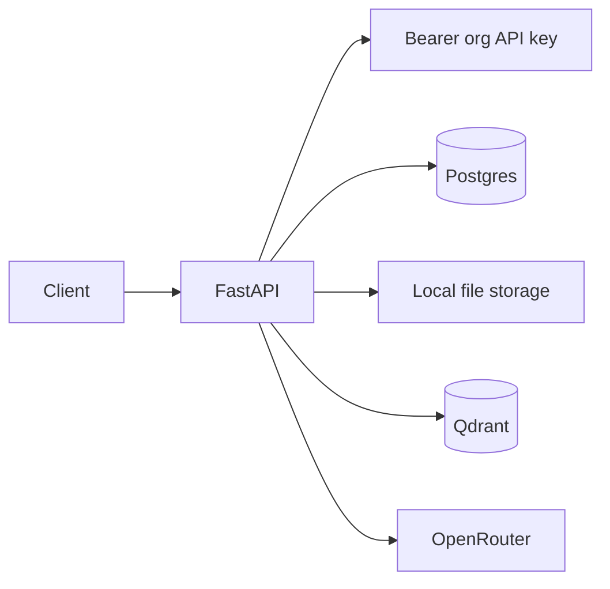
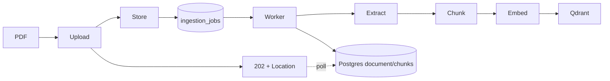
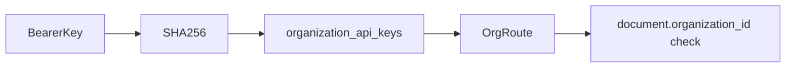

# Sentineth Project Status

## Vision

Sentineth is intended to be a company intelligence platform: it should connect Slack, Teams, GitHub, email, meetings, documents, and internal systems; continuously build organizational memory; become the company-wide source of truth; answer questions with grounded retrieval; and eventually power agent workflows.

## Current State Summary

Maturity is approximately **25%** of that vision, through Phase 2 of
`docs/ROADMAP.md`. Today the repository provides a backend-first PDF RAG
service: organizations, organization-filtered document storage and Qdrant
search, measured retrieval, durable background ingestion behind an async
202 contract, bounded inputs and per-organization quotas, and OpenRouter
answer generation. It has no frontend, user accounts, RBAC, connectors,
agents, or production operations.

Architecture: FastAPI + SQLAlchemy/Postgres for state and for the job
queue, a separate worker process for ingestion, local filesystem for
source files, Qdrant for vectors, NVIDIA `nemotron-3-embed-1b` for
embeddings (MiniLM remains as the offline provider), and OpenRouter for
the answer model.

## Completed Work

### Multi-Tenant Foundation

`Organization`, `Document`, and Qdrant payloads carry organization identity. Retrieval filters Qdrant by `organization_id`; document deletion/reindex services compare the URL organization with `Document.organization_id`.

### Security Hardening

Commit `d8dec032e40c1b20f704f52fd82642b9aef90d45` — `feat: secure organization document lifecycle` — adds `OrganizationApiKey`, SHA-256 key storage, one-time key creation, rotation, route authorization, document ownership validation, and organization-scoped vector deletion. See `backend/app/security.py`, `backend/app/main.py`, and `backend/app/services/document_service.py`.

### RAG Infrastructure

PDF upload extracts text with pypdf, chunks it, embeds chunks, stores vectors in Qdrant, retrieves tenant-filtered chunks, and sends grounded context to OpenRouter. Sources return document/chunk metadata. Core paths are `backend/app/services/ingestion_service.py`, `retrieval_service.py`, and `query_service.py`.

### Document Lifecycle

Implemented routes: upload, status, list, delete, and single-document reindex in `backend/app/api/documents.py`. Upload, delete and reindex answer 202 and queue work; delete removes organization-filtered vectors, the stored file, and the database record.

### Measurable Retrieval (Phase 1)

Chunking follows semantic boundaries and is sized to the embedding model's token window; retrieval carries page numbers into citations. `backend/eval/` holds a 22-document corpus and 134 questions in four kinds — span, identifier, unanswerable and conflicting — with recall@k, MRR and per-kind reporting, and `compare.py` for paired significance testing between runs. Latest run: **94.1% recall@5, MRR 0.832** across the 118 recall-scored questions.

### Durable Ingestion and Limits (Phase 2)

`ingestion_jobs` in Postgres, claimed by `python -m app.worker` with `SELECT ... FOR UPDATE SKIP LOCKED` under a lease, with finite retries and dead-lettering. Blocking work runs in a thread; every provider call has a timeout. `app/settings.py` bounds upload size, page count, chunk count, request body, query length, and per-organization documents, storage, pending jobs, uploads per minute and queries per minute. Failures carry stable error codes: 409, 410, 413, 415, 422, 429, 503.

## Current Architecture

### Ingestion Flow

### Query Flow

### Authorization Flow

## Repository Map

- `backend/app/api`: FastAPI HTTP routes; `documents.py` owns lifecycle/search/query endpoints.
- `backend/app/services`: business flow; ingestion, chunking, extraction, retrieval, query, and document lifecycle.
- `backend/app/db`: SQLAlchemy engine and `Organization`, `Document`, `DocumentChunk`, `OrganizationApiKey`, `IngestionJob`, `OrganizationRateLimit` models.
- `backend/app/worker.py`: claims and runs ingestion jobs; `settings.py` holds the validated resource limits.
- `backend/eval`: retrieval corpus, question set and harness.
- `backend/app/providers`: swappable embeddings, LLM, storage, and vector interfaces/adapters.
- `backend/tests`: in-memory provider tests for RAG, chunking and durable jobs; `test_postgres_jobs.py` needs a real Postgres and skips without `TEST_POSTGRES_URL`.
- `backend/alembic`: schema migrations; API-key migration is `4bc9d8e2f3a1_add_organization_api_keys.py`.

## Current Technical Debt

- No user model, memberships, RBAC, audit logs, secrets manager, observability, backups, DR, or production deployment pipeline. API-key list/revoke/rotate landed in Phase 0.4; CI landed in 0.2; rate limiting landed in 2.3.
- Cross-organization rejection is tested on every document route, but revoked, expired and malformed credentials are not (Phase 3.2).
- `POST /organizations` is still unauthenticated and unthrottled — the top blocker before any deployment.
- PDF-only extraction; unsupported types map to 415.
- Local storage is still a scalability bottleneck, and the worker is a single process by default (it scales by running more).
- No real Qdrant/OpenRouter integration suite. Postgres has two gated tests, and the retrieval benchmark exists in `backend/eval/`.

## Vision Gap Analysis

### Already Built

PDF RAG, tenant-filtered vector retrieval, API-key foundation, and basic document lifecycle.

### Partially Built

Multi-tenancy and security: organization boundaries exist, but there are no users or roles. Organizational knowledge is document-only, not persistent cross-source memory.

### Completely Missing

Slack, GitHub, Teams, email, meeting ingestion, change detection, organizational memory, knowledge graph, agents/workflows, and frontend.

## Next Priorities

See `docs/ROADMAP.md`. It is the single source of truth for sequencing, and
replaces the three-phase priority tables that used to sit here.

## Enterprise Readiness Assessment

Security **40%**: hashed org keys, tenant filters and per-organization rate limits, but no users/RBAC/audits and open organization creation. Multi-tenancy **60%**: org filters, ownership checks and per-org quotas exist, but membership administration is absent. Observability **10%**, compliance **5%**, reliability **45%** (durable retries, explicit failure taxonomy, no backups or DR), scalability **35%** (ingestion is off the request path and horizontally scalable; storage is not).

## Guidance For Future Contributors

Read this document and `info.md` first. Inspect architecture and call sites before edits. Preserve organization boundaries in every DB query, vector filter, storage path, and service action. Never bypass authorization. Keep commits narrowly scoped; do not mix generated artifacts with feature work; run tests before every commit.

## Recommended Next Task

Phase 3 of `docs/ROADMAP.md`: users, memberships and roles, then the full
credential test matrix against every route, then an operable service. Phases
0, 1 and 2 are delivered. The first thing to close inside Phase 3 is
`POST /organizations`, which anyone who can reach the service can still call.
